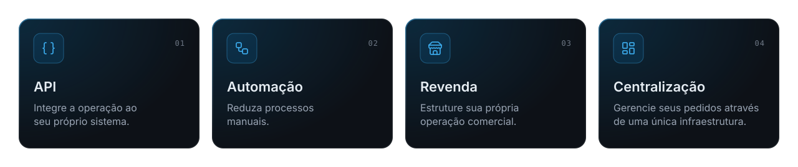

<div align="center">



<br>
<br>

[](#introdução)
&nbsp;
[](https://assinex.com)

<br>


</div>

<br>

> [!NOTE]
> Guia independente. **Google** e **Gemini** são marcas do Google LLC. Este material não tem vínculo, patrocínio ou endosso do Google. Planos, nomes e benefícios mudam com frequência — confira sempre as fontes oficiais.

<br>

## Sumário

| | Seção | Do que trata |
| :-: | --- | --- |
| `01` | [Introdução](#introdução) | Para quem é este guia e como ele está organizado |
| `02` | [O que é o Gemini Pro?](#o-que-é-o-gemini-pro) | A diferença entre a assinatura do app e o modelo via API |
| `03` | [Como funcionam as assinaturas](#como-funcionam-as-assinaturas) | Ciclo de vida e formas de ativação |
| `04` | [Cuidados ao comprar de terceiros](#cuidados-ao-comprar-de-terceiros) | Boas práticas e sinais de alerta |
| `05` | [Por que os preços podem variar tanto?](#por-que-os-preços-podem-variar-tanto) | Os fatores por trás de cada valor |
| `06` | [Para quem trabalha com revenda](#para-quem-trabalha-com-revenda) | As camadas de uma operação e o modelo manual vs. integrado |
| `07` | [Revenda através de API](#revenda-através-de-api) | Onde integrar e o que avaliar em uma API |
| `08` | [Como a Assinex pode ajudar](#como-a-assinex-pode-ajudar) | Infraestrutura e fornecimento para revendedores |
| `09` | [Fluxo de integração](#fluxo-de-integração) | O caminho de um pedido, do cliente à entrega |
| `10` | [Construa sua própria operação](#construa-sua-própria-operação) | Exemplo conceitual de uso da API |
| `11` | [Perguntas frequentes](#perguntas-frequentes) | Respostas diretas |

<br>

## Introdução

Um material técnico e independente para entender o **Google Gemini Pro** do ponto de vista de quem compra, revende ou integra **assinaturas digitais**.

O interesse por ferramentas de inteligência artificial criou um mercado ativo de assinaturas — e, junto com ele, muitas dúvidas. O que exatamente está sendo vendido quando alguém anuncia uma *assinatura Gemini*? Por que os preços variam tanto? O que muda para quem quer revender em vez de apenas usar?

Este guia organiza essas respostas em sequência: primeiro o produto, depois o modelo de assinatura, os cuidados na compra, a lógica da revenda e, por fim, como a integração por API pode estruturar uma operação.

| Para | O que você encontra aqui |
| --- | --- |
| **Desenvolvedores** | Como integrar pedidos e entrega em lojas, bots e sistemas próprios |
| **Revendedores** | Fornecimento, precificação e rotina operacional da revenda |
| **Quem trabalha com produtos digitais** | Como funciona a distribuição de acessos, licenças e assinaturas |

<br>

## O que é o Gemini Pro?

**Gemini** é a família de modelos de inteligência artificial e o assistente desenvolvidos pelo Google. Os modelos da linha “Pro” são as versões voltadas a tarefas mais complexas de raciocínio, código e análise.

O termo **“Gemini Pro”** aparece em dois contextos diferentes — e confundi-los é um dos erros mais comuns do mercado:

| | Contexto 1 · Assinatura no app | Contexto 2 · Modelo via API |
| --- | --- | --- |
| **Para quem** | Usuários finais e profissionais | Desenvolvedores e empresas |
| **Onde** | App e versão web do Gemini, com uma Conta Google | Gemini API (Google AI Studio) e Vertex AI (Google Cloud) |
| **Cobrança** | Assinatura recorrente de um plano pago do Google | Por uso, normalmente pelo volume de tokens processados |
| **No mercado** | É o que normalmente se chama de “assinatura Gemini Pro” | Não é uma assinatura: é consumo de API faturado na conta do desenvolvedor |

> [!IMPORTANT]
> Quando se fala em **revenda Gemini** ou “assinatura Gemini Pro”, quase sempre o assunto é o plano pago do app — não o uso da API pelos desenvolvedores. Este guia segue essa convenção. Os nomes comerciais desses planos já mudaram algumas vezes (por exemplo, de *Gemini Advanced* para *Google AI Pro*); use sempre o nome exibido atualmente pelo Google.

<br>

## Como funcionam as assinaturas

A assinatura do Gemini é um benefício vinculado a uma **Conta Google**. Entender o ciclo de vida dela ajuda a avaliar qualquer oferta — oficial ou de terceiros.

```text
  Conta Google  ──▶  Plano  ──▶  Ativação  ──▶  Renovação
  (titular)          (benefícios    (direta, convite    (recorrente até o
                      por região)    ou código)          cancelamento)
```

### Formas de ativação mais comuns no mercado

Fora da contratação direta, as assinaturas digitais costumam ser distribuídas em algumas modalidades. Cada uma tem implicações diferentes de segurança, duração e suporte.

| Modalidade | Como funciona | O que verificar |
| --- | --- | --- |
| **Assinatura direta** | O próprio titular contrata o plano na sua Conta Google | Preço oficial da sua região e forma de cobrança |
| **Link de ativação** | O cliente recebe um link ou convite e ativa o benefício na própria conta | Validade do link e duração real do benefício |
| **Código de resgate** | Um código é aplicado no serviço para liberar o acesso | Região de uso do código e data de expiração |
| **Conta pronta** | O cliente recebe uma conta com o acesso já ativo | Titularidade, segurança dos dados e regras de uso do serviço |

> [!TIP]
> Ofertas promocionais — períodos de teste, condições para estudantes ou combos com dispositivos — aparecem com frequência e têm regras próprias de elegibilidade e duração. Leia as condições antes de usar o preço promocional como referência.

<br>

## Cuidados ao comprar de terceiros

Comprar de terceiros pode ser legítimo, mas o comprador assume riscos que não existem na contratação direta. Estes são os pontos que mais importam na prática.

| ✔ Boas práticas | ✖ Sinais de alerta |
| --- | --- |
| Saber exatamente qual modalidade de entrega está sendo comprada | Pedido da senha ou de códigos de verificação da sua Conta Google pessoal |
| Confirmar a duração real do acesso e o que acontece se ele for interrompido | Promessa de acesso “vitalício” a um serviço cobrado de forma recorrente |
| Verificar a identificação do vendedor, o histórico e o canal de suporte | Ausência de qualquer política de garantia ou de atendimento |
| Preferir meios de pagamento rastreáveis e guardar o comprovante | Preço muito abaixo do mercado sem explicação da origem |
| Conhecer os Termos de Serviço do Google aplicáveis ao produto | Pressão para fechar a compra imediatamente |

> [!WARNING]
> Modalidades como contas compartilhadas podem contrariar os termos de uso do serviço e resultar em suspensão do acesso. Quem revende deve conhecer essas regras antes de oferecer qualquer modalidade aos próprios clientes.

<br>

## Por que os preços podem variar tanto?

É comum encontrar a mesma “assinatura Gemini” anunciada por valores muito diferentes. Na maioria dos casos, a diferença tem explicação — e entender os fatores ajuda a comparar ofertas de forma justa.

| Fator | Impacto no preço |
| --- | --- |
| **Preço regional** | O Google pratica preços diferentes por país e moeda |
| **Promoções e condições especiais** | Períodos de teste e ofertas específicas reduzem o custo de entrada por tempo limitado |
| **Modalidade de entrega** | Ativação na própria conta, código ou conta pronta envolvem custos e riscos distintos |
| **Duração** | Mensal, trimestral ou anual: o custo por mês muda conforme o período |
| **Canal e volume** | Quem compra em volume, de fornecedores estruturados, opera com custos diferentes |
| **Câmbio, impostos e taxas** | Variação cambial, tributos e taxas de pagamento entram no preço final |

> [!TIP]
> Para comparar, normalize as ofertas pelo **custo mensal** e considere a modalidade de entrega e a garantia. Preço baixo não é, por si só, sinal de problema — mas é sempre um bom motivo para entender a origem.

<br>

## Para quem trabalha com revenda

Revender assinaturas digitais é, na prática, operar uma pequena cadeia de suprimentos: alguém fornece, alguém vende, alguém entrega e alguém dá suporte.

| Camada | Responsabilidade |
| --- | --- |
| `1` **Fornecimento** | De onde vem o produto e em quais condições |
| `2` **Canal de venda** | Site, loja, bot, redes sociais ou marketplace |
| `3` **Pagamento** | Recebimento, conciliação e controle de margem |
| `4` **Entrega** | Como o acesso chega ao cliente final |
| `5` **Pós-venda** | Suporte, dúvidas de ativação e garantia |

### Operação manual vs. operação integrada

| Etapa | Manual | Integrada |
| --- | --- | --- |
| **Compra no fornecedor** | Feita à mão a cada venda | Disparada pelo próprio sistema |
| **Entrega ao cliente** | Copiar e colar o acesso | Enviada pelo fluxo da loja ou do bot |
| **Horário** | Depende de alguém disponível | Não depende de alguém online |
| **Registro** | Planilhas e conversas | Histórico centralizado de pedidos |
| **Escala** | Cresce junto com o esforço | Cresce sem multiplicar o trabalho manual |

Nenhum dos modelos é “o certo”. Muitas operações começam manuais e migram para a integração quando o volume cresce ou quando as vendas passam a acontecer em horários em que ninguém está disponível para atender.

<br>

## Revenda através de API

Uma API permite que o sistema do revendedor converse diretamente com o fornecedor: a venda acontece em um lugar, o pedido é criado em outro, e ninguém precisa intermediar cada etapa à mão.

**Onde a integração costuma acontecer:** loja virtual ou site · bots de atendimento · painel administrativo · sistema próprio ou ERP.

### O que avaliar em uma API para revenda

Antes de integrar qualquer **API de assinaturas**, vale verificar alguns pontos técnicos. Eles determinam o quanto a operação será estável quando o volume crescer.

| Ponto | Por que importa |
| --- | --- |
| **Autenticação** | Credenciais por parceiro, que possam ser revogadas e trocadas com segurança |
| **Catálogo e disponibilidade** | Consultar produtos antes de vender evita anunciar o que não há |
| **Criação de pedidos** | Uma forma clara e documentada de registrar a compra |
| **Status e notificações** | Saber quando o pedido mudou de estado, por consulta ou por aviso automático |
| **Proteção contra duplicidade** | Repetir uma requisição por falha de rede não deveria gerar uma segunda cobrança |
| **Documentação e erros** | Respostas previsíveis e documentação acessível facilitam a manutenção |

> [!NOTE]
> Esta lista descreve boas práticas gerais de integração e não se refere a um fornecedor específico. Para saber quais recursos uma API oferece, consulte sempre a documentação oficial do fornecedor.

<br>

## Como a Assinex pode ajudar

> Existem diferentes formas de adquirir e distribuir assinaturas digitais. Para quem trabalha com revenda, uma infraestrutura com API pode simplificar boa parte da operação.

A **[Assinex](https://assinex.com)** é uma plataforma de produtos e assinaturas digitais com estrutura voltada para revendedores. Ela pode ser utilizada como **infraestrutura e meio de fornecimento** de uma operação de revenda: o revendedor cuida do próprio canal de venda e do relacionamento com o cliente, e os pedidos passam por uma plataforma centralizada.

Para quem já tem uma operação digital, a Assinex possui **API**, permitindo integrar o fluxo de pedidos a sistemas, lojas, bots ou painéis próprios — e automatizar etapas que, de outra forma, seriam feitas manualmente a cada venda.

### Por que Assinex?



> [!NOTE]
> **Transparência.** A Assinex é uma plataforma independente. Ela não é parceira oficial, fornecedora oficial nem revendedora autorizada do Google. Catálogo, disponibilidade e condições devem ser consultados diretamente na plataforma.

<br>

## Fluxo de integração

Visão simplificada de como um pedido percorre uma operação de revenda integrada à Assinex por API — do clique do cliente até a entrega.



<sub>Diagrama conceitual. As etapas e a nomenclatura reais podem variar; consulte a documentação oficial da API.</sub>

<br>

## Construa sua própria operação

Para quem já possui um **site, painel, bot ou sistema próprio**, uma API permite integrar a operação da Assinex ao fluxo que já existe: a venda acontece no seu canal, o pedido é criado na plataforma e o resultado volta para o seu sistema.



```javascript
// Exemplo conceitual
const order = await assinex.createOrder({
    product: "gemini-pro",
    customer: "cliente@example.com"
});
```

<details>
<summary><b>Ver um fluxo completo (também conceitual)</b></summary>
<br>

```javascript
// Exemplo conceitual — nomes e parâmetros fictícios.
// Consulte a documentação oficial para a implementação real.

async function onSaleCompleted(sale) {
  // 1. A venda aconteceu no seu canal (loja, bot ou painel)
  const order = await assinex.createOrder({
    product: "gemini-pro",
    customer: sale.customerEmail
  });

  // 2. Seu sistema decide como entregar ao cliente
  await notifyCustomer(sale.customerEmail, order);
}
```

</details>

> [!CAUTION]
> **Exemplo ilustrativo — consulte a documentação oficial da API para implementação.**
> O objeto `assinex`, o método e os parâmetros acima são fictícios e servem apenas para ilustrar o fluxo. Endpoints, autenticação e formatos de resposta estão na documentação oficial, acessível em [assinex.com](https://assinex.com).

<br>

## Perguntas frequentes

<details>
<summary><b>O Gemini Pro é um produto do Google?</b></summary>
<br>

Sim. O Gemini, seus modelos e seus planos de assinatura são produtos e serviços do Google. Este guia é um material independente e não tem vínculo com o Google.

</details>

<details>
<summary><b>A Assinex é parceira ou fornecedora oficial do Google?</b></summary>
<br>

Não. A Assinex é uma plataforma independente de produtos e assinaturas digitais. Ela não é parceira oficial, fornecedora oficial nem revendedora autorizada do Google.

</details>

<details>
<summary><b>Qual a diferença entre a assinatura do Gemini e a API do Gemini?</b></summary>
<br>

A assinatura dá acesso a recursos avançados no app do Gemini e é vinculada a uma Conta Google, com cobrança recorrente. A API do Gemini é voltada para desenvolvedores, é acessada pelo Google AI Studio ou pelo Vertex AI e costuma ser cobrada por uso. Quando o mercado fala em “assinatura Gemini Pro”, normalmente se refere ao plano do app.

</details>

<details>
<summary><b>É seguro comprar uma assinatura Gemini de terceiros?</b></summary>
<br>

Depende do vendedor e da modalidade de entrega. Entenda exatamente o que está sendo entregue, confirme a duração e a garantia, nunca compartilhe a senha ou códigos de verificação da sua Conta Google pessoal e verifique se a modalidade respeita os termos de uso do serviço. Veja o [checklist completo](#cuidados-ao-comprar-de-terceiros).

</details>

<details>
<summary><b>Por que a mesma assinatura aparece com preços tão diferentes?</b></summary>
<br>

Preço regional, promoções, modalidade de entrega, duração do plano, canal de fornecimento, câmbio, impostos e taxas influenciam o valor final. Para comparar ofertas, normalize pelo custo mensal e considere a garantia oferecida.

</details>

<details>
<summary><b>Preciso de uma API para revender assinaturas digitais?</b></summary>
<br>

Não. Muitas operações começam de forma manual. A API passa a fazer diferença quando o volume cresce, quando a venda acontece fora do horário comercial ou quando o objetivo é eliminar etapas manuais como comprar, copiar e enviar cada acesso.

</details>

<details>
<summary><b>Posso integrar a Assinex à minha loja, bot ou painel?</b></summary>
<br>

A Assinex possui API voltada para integração com sistemas próprios, lojas, bots e painéis de revendedores. Os detalhes técnicos da implementação estão na documentação oficial, acessível a partir de [assinex.com](https://assinex.com).

</details>

<details>
<summary><b>O código de exemplo deste guia funciona de verdade?</b></summary>
<br>

Não. O código apresentado é um exemplo conceitual, com nomes e parâmetros fictícios, criado apenas para ilustrar o fluxo. Para implementar, consulte a documentação oficial da API da Assinex.

</details>

<br>

---

<div align="center">

### Quer integrar uma operação de revenda ao seu próprio sistema?

A Assinex possui API para integração com lojas, bots, painéis e sistemas próprios.<br>
Se faz sentido para a sua operação, conheça a plataforma e a documentação oficial.

<br>

[](https://assinex.com)

</div>

---

<sub>Conteúdo informativo, sem caráter de aconselhamento jurídico ou financeiro. Google e Gemini são marcas do Google LLC. Este projeto e a Assinex não são afiliados, patrocinados nem endossados pelo Google. Licenciado sob [MIT](LICENSE).</sub>
